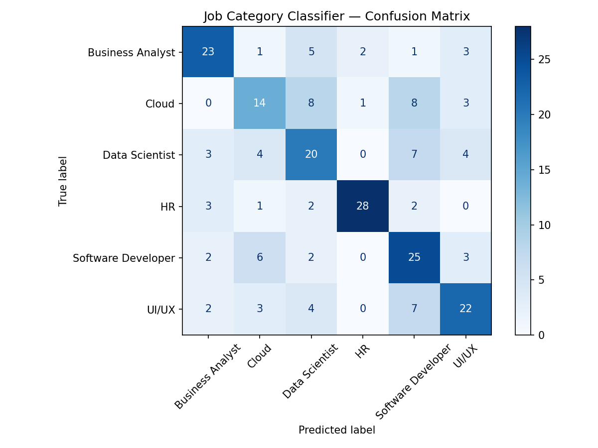

# Job Market Analyzer

A machine learning project that classifies job postings into role categories using NLP. 
Built as a portfolio project for AI/ML working student applications.

## Live Demo
Run locally with: `streamlit run app.py`

## What it does
- Takes job details (workplace, location, department, type) as input
- Predicts the job category using a trained ML classifier
- Shows confidence scores for all 6 categories as a bar chart

## Results

| Model | Macro F1 Score |
|-------|---------------|
| Random Forest + TF-IDF | 0.597 |
| Logistic Regression + TF-IDF | 0.606 |

Logistic Regression outperformed Random Forest on this text classification task,
which is expected since TF-IDF produces sparse high-dimensional vectors that 
linear models handle well.

Best performing category: **HR (F1: 0.84)**
Hardest to classify: **Cloud vs Software Developer** (similar technical profiles)

## Confusion Matrix

## Categories predicted
- Business Analyst
- Cloud
- Data Scientist
- HR
- Software Developer
- UI/UX

## Tech stack
- Python 3.13
- scikit-learn — TF-IDF vectorizer, Logistic Regression, Random Forest
- sentence-transformers — all-MiniLM-L6-v2 embeddings
- Streamlit — interactive web demo
- pandas, matplotlib, seaborn

## How to run

git clone https://github.com/niasattari/job-market-analyzer.git
cd job-market-analyzer
pip install -r requirements.txt
streamlit run app.py

## Project structure

├── app.py                    # Streamlit demo app
├── job-market-analyzer.ipynb # Full ML notebook with EDA and modeling
├── best_model.pkl            # Trained Logistic Regression model
├── categories.json           # Label encoder categories
├── confusion_matrix.png      # Model evaluation visualization
├── job_data_merged_1.csv     # Dataset (1095 job postings, 6 categories)
└── requirements.txt